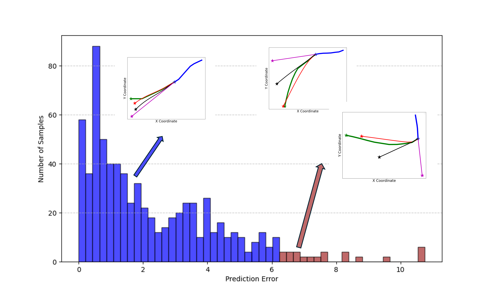
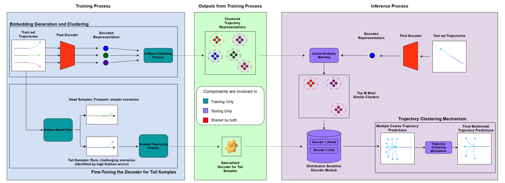
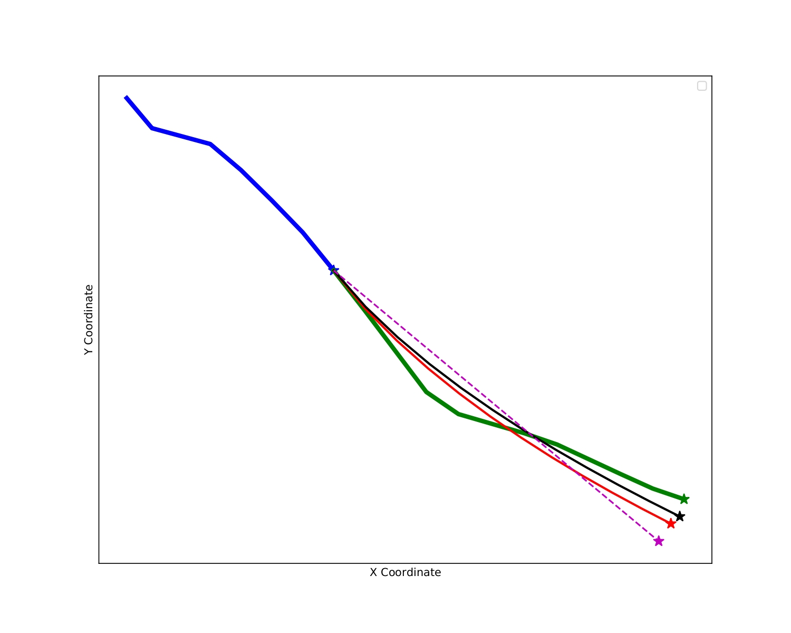
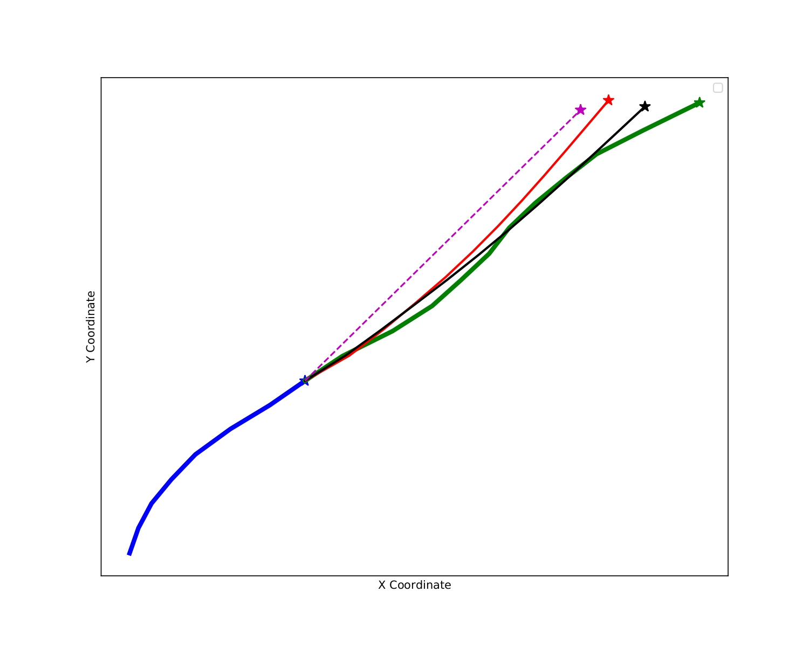
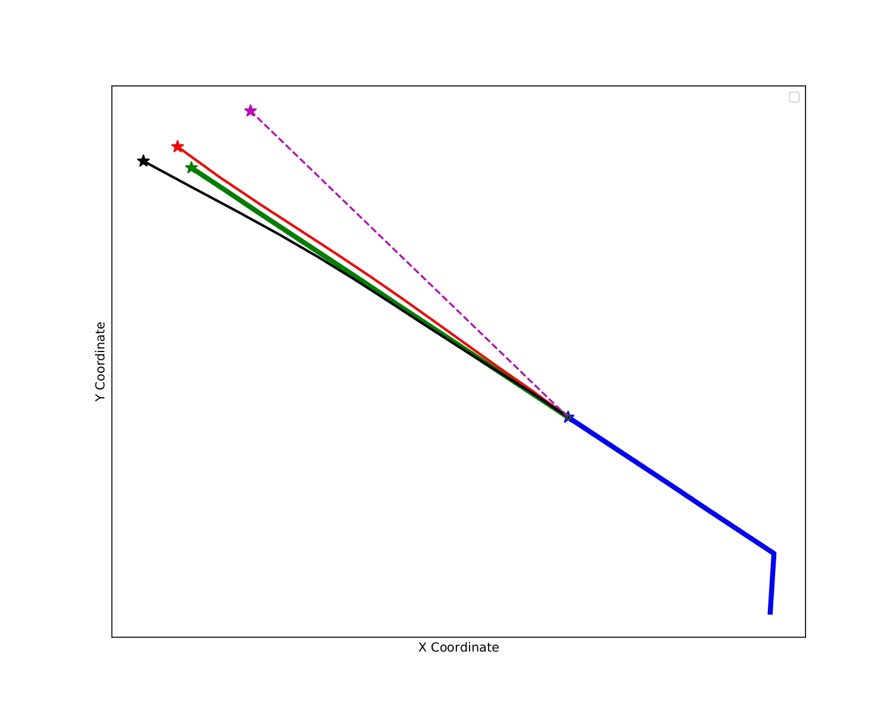
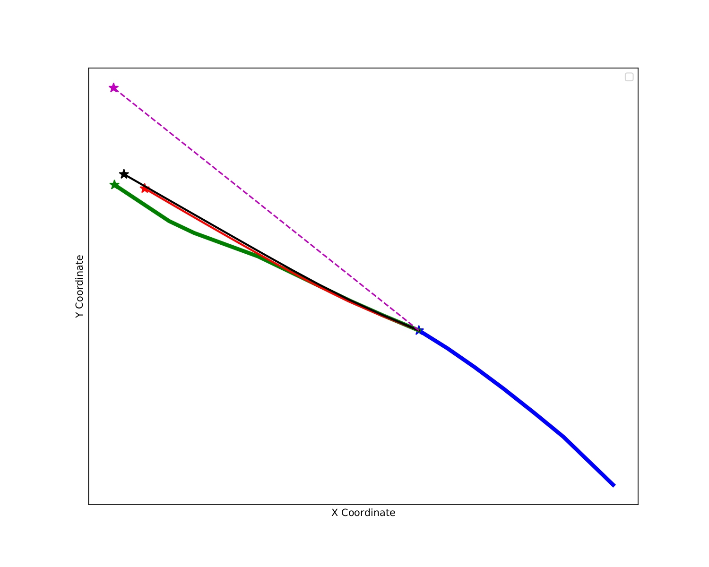

# Enhancing Predictive Performance on Long-Tail Trajectories via Clustering and Specialized Decoders

**Official repository for the paper**:  
**"Enhancing Predictive Performance on Long-Tail Trajectories via Clustering and Specialized Decoders"**  
📍 G. Ganeshaaraj, Tharindu Fernando, Sridha Sridharan, Clinton Fookes

## Abstract

Accurate forecasting of traffic participants' future trajectories is crucial for the advancement of autonomous driving systems. Constructing robust models for such tasks requires access to comprehensive datasets that include a variety of diverse cases. Current naturalistic trajectory prediction datasets are often imbalanced, featuring a large number of easier examples and a deficiency of more challenging instances. This long-tail distribution poses a significant challenge, resulting in inadequate model performance on the rare, yet safety-critical, parts of the data. To address this issue, we have proposed a framework that utilises an embedding-based clustering technique and a distribution-sensitive decoder module to generate precise predictions for tail samples. In addition, the proposed framework includes a trajectory clustering module to refine predictions and improve the model's capacity to generate multiple plausible future trajectories. Experimental results show that our framework outperforms the state-of-the-art long tail prediction method on tail samples by 19.5% on the Average Displacement error (ADE) and 25.5% on the Final Displacement error (FDE). Additionally, our approach attains state-of-the-art performance in terms of ADE metric on the ETH/UCY datasets, while only slightly trailing Y-Net in terms of the FDE metric. We further conduct ablation studies to
highlight the efficacy of each of the proposed innovations.

  

**Figure 1**: A Histogram illustrating the distribution of the ETH dataset categorised by sample difficulty. The difficulty is assessed based on the displacement error of a Kalman filter, following prior works. We present the easy scenarios (head class) in blue and the complex/challenging scenarios (tail class) in red. The inserts show three sample scenarios: one head sample and two tail samples and compare trajectory predictions from the State-Of-The-Art (SOTA) model with those generated by our methodology. Our method specifically focuses on improving performance in challenging tail scenarios while also preserving strong accuracy in relatively easier head scenarios.

---

## 🧠 Model

  

**Figure 2**: The proposed framework consists of three stages. Stage 1: Embedding Generation and Clustering takes trajectories from the training set as input, and extracts feature embeddings that are subsequently clustered to identify representative trajectory patterns. The output of this stage is a set of learned cluster centers. Stage 2: Fine-Tuning the Decoder for Tail Samples focuses on optimising a distribution-sensitive decoder module using trajectories from the training set. This step ensures improved predictive performance, particularly for rare and challenging trajectories. Finally, Stage 3: Inference utilises test trajectories, along with the cluster centers from Stage 1 and the decoder module from Stage 2, to generate multimodal trajectory predictions. The decoder generates multimodal predictions that maintain consistency with learned trajectory distributions while accommodating fine-grained variations.  

---

## 🧾 Code

Code is coming soon! Stay tuned 🔧🤖🔨

---

## 📊 Results

### 🟦 Head Sample Predictions  

  
  
  
  

### 🟥 Tail Sample Predictions  

  
  
  
  

